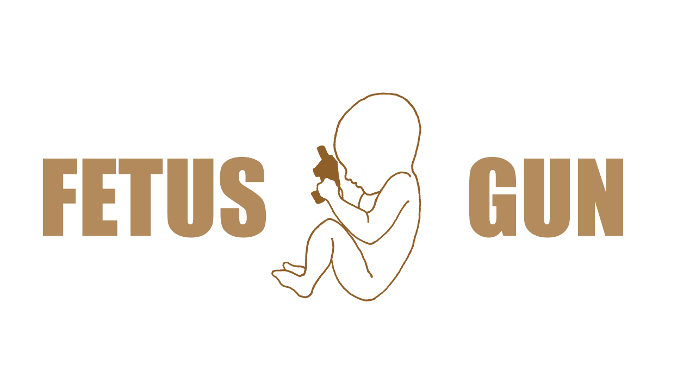
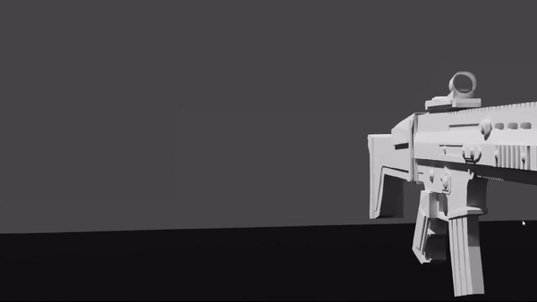

  

 

<!-- Languages icons -->

 
  
   
 

  
  
  ### 🔫 Fetus Gun is Learning Computer Graphics Programming and 3D Modelling
------------------------------------------------------------------------------------------------------------------

  

 

2022 - [@fetus_gun](https://twitter.com/fetus_gun)

  
  
  <!---
- 👋 Hi, I’m @pauloferrdraw
- 👀 I’m interested in ...
- 🌱 I’m currently learning ...
- 💞️ I’m looking to collaborate on ...
- 📫 How to reach me ...

pauloferrdraw/pauloferrdraw is a ✨ special ✨ repository because its `README.md` (this file) appears on your GitHub profile.
You can click the Preview link to take a look at your changes.
--->
